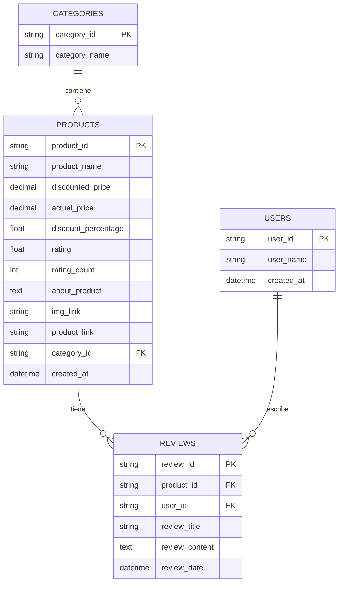
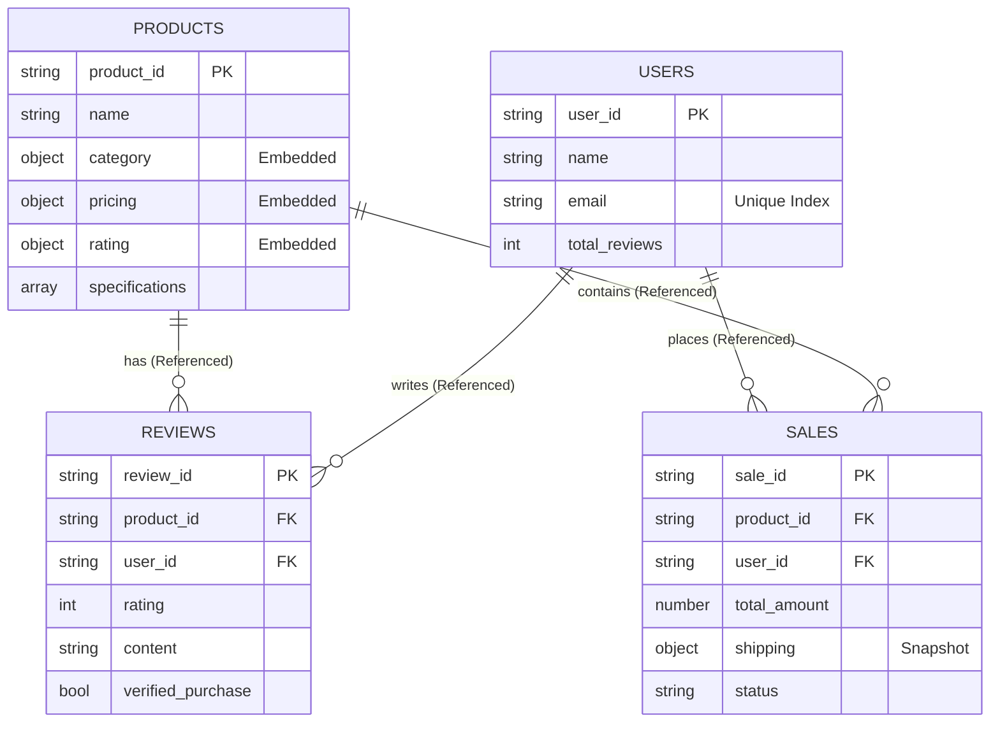

<div align="center">

# 🚀 GlobalMarket Analytics & Search Engine


### 📚 Universidad Nacional Experimental de Guayana (UNEG)

**Sistemas de Bases de Datos II • Semestre 2025-II**

---

[🎯 Características](#-características-principales) •
[📦 Instalación](#-guía-de-instalación) •
[🏗️ Arquitectura](#-arquitectura-de-datos) •
[📊 Analytics](#-analytics-y-consultas) •
[📈 Dashboard](#-mongodb-charts-dashboard) •
[👥 Equipo](#-equipo-de-desarrollo)

</div>

---

## 📋 Tabla de Contenidos

- [🚀 GlobalMarket Analytics \& Search Engine](#-globalmarket-analytics--search-engine)
  - [📚 Universidad Nacional Experimental de Guayana (UNEG)](#-universidad-nacional-experimental-de-guayana-uneg)
  - [📋 Tabla de Contenidos](#-tabla-de-contenidos)
  - [📋 Descripción del Proyecto](#-descripción-del-proyecto)
    - [¿Por qué MongoDB para E-commerce?](#por-qué-mongodb-para-e-commerce)
  - [✨ Características Principales](#-características-principales)
    - [🎯 Modelado de Datos](#-modelado-de-datos)
    - [🔒 Calidad de Datos](#-calidad-de-datos)
    - [🚀 Performance](#-performance)
    - [📊 Analytics](#-analytics)
  - [🏗️ Arquitectura de Datos](#️-arquitectura-de-datos)
    - [Modelo de Datos Relacional (Diagrama Entidad-Relación - ERD)](#modelo-de-datos-relacional-diagrama-entidad-relación---erd)
    - [Modelo de Datos NoSQL (MongoDB/JSON Schema)](#modelo-de-datos-nosql-mongodbjson-schema)
    - [Estrategias de Diseño](#estrategias-de-diseño)
  - [🛠️ Guía de Instalación](#️-guía-de-instalación)
    - [Prerrequisitos](#prerrequisitos)
    - [📦 Paso 1: Configuración del Entorno](#-paso-1-configuración-del-entorno)
    - [🔄 Paso 2: Transformación de Datos (ETL)](#-paso-2-transformación-de-datos-etl)
    - [🛡️ Paso 3: Aplicar Validaciones (Schema Validation)](#️-paso-3-aplicar-validaciones-schema-validation)
    - [📥 Paso 4: Ingesta de Datos](#-paso-4-ingesta-de-datos)
    - [⚡ Paso 5: Indexación Inteligente](#-paso-5-indexación-inteligente)
  - [📊 Analytics y Consultas](#-analytics-y-consultas)
    - [🔎 Pipelines Implementados](#-pipelines-implementados)
  - [📁 Estructura del Proyecto](#-estructura-del-proyecto)
  - [📈 Análisis de Performance (Explain Plan)](#-análisis-de-performance-explain-plan)
  - [📊 MongoDB Charts Dashboard](#-mongodb-charts-dashboard)
  - [👥 Equipo de Desarrollo](#-equipo-de-desarrollo)

---

## 📋 Descripción del Proyecto

**GlobalMarket** es una implementación completa de un sistema de comercio electrónico utilizando **MongoDB Atlas**. Este proyecto demuestra la transición de un modelo relacional tradicional a una arquitectura documental NoSQL, diseñada específicamente para manejar **Big Data en E-commerce**.

<div align="center">

|    🎯 Objetivo    | 📌 Descripción                                     |
| :---------------: | :------------------------------------------------- |
|   **Migración**   | Transición de modelo relacional a NoSQL documental |
| **Escalabilidad** | Arquitectura preparada para millones de documentos |
|   **Analytics**   | Dashboards en tiempo real con MongoDB Charts       |
|   **Búsqueda**    | Full-text search con Atlas Search (Lucene)         |

</div>

### ¿Por qué MongoDB para E-commerce?

El sistema ha sido optimizado para resolver los principales desafíos del comercio electrónico moderno:

- ⚡ **Alto rendimiento** en consultas de agregación complejas
- 📊 **Analytics en tiempo real** para dashboards de ventas
- 🔍 **Búsqueda inteligente** (Fuzzy Search) con Atlas Search
- 🛡️ **Integridad de datos** mediante validaciones estrictas JSON Schema
- 🚀 **Escalabilidad horizontal** nativa de MongoDB

---

## ✨ Características Principales

<table>
<tr>
<td width="50%">

### 🎯 Modelado de Datos

- **Hybrid Pattern**: Embedding + Referencing
- **Computed Pattern**: Métricas pre-calculadas
- **Snapshot Pattern**: Historial de precios y direcciones

</td>
<td width="50%">

### 🔒 Calidad de Datos

- Validaciones `jsonSchema` en 4 colecciones
- Reglas de negocio a nivel de DB
- Precios positivos, emails válidos, ratings 0-5

</td>
</tr>
<tr>
<td>

### 🚀 Performance

- Índices compuestos estratégicos
- Atlas Search (Lucene) para full-text
- Índices únicos para integridad

</td>
<td>

### 📊 Analytics

- 5 Pipelines de agregación complejos
- `$lookup`, `$unwind`, `$bucket`, `$graphLookup`
- Análisis de cohortes y segmentación VIP

</td>
</tr>
</table>

---

## 🏗️ Arquitectura de Datos

### Modelo de Datos Relacional (Diagrama Entidad-Relación - ERD)



### Modelo de Datos NoSQL (MongoDB/JSON Schema)



### Estrategias de Diseño

| 📦 Colección | 🔧 Estrategia             | 📝 Justificación Técnica                                                                  |
| :----------- | :------------------------ | :---------------------------------------------------------------------------------------- |
| `products`   | 🔄 **Hybrid (Embedding)** | Categorías, precios y ratings embebidos para lectura rápida `O(1)`. Evita JOINs costosos. |
| `reviews`    | 🔗 **Referencing**        | Colección separada para evitar el límite de 16MB por documento (BSON Limit).              |
| `users`      | 🔗 **Referencing**        | Entidad independiente. Facilita cumplimiento de normas de privacidad.                     |
| `sales`      | 📸 **Ref + Snapshot**     | Referencia productos pero **duplica** datos históricos (precio al momento de venta).      |

---

## 🛠️ Guía de Instalación

### Prerrequisitos

| Herramienta                                                                                    | Versión | Descripción                  |
| :--------------------------------------------------------------------------------------------- | :------ | :--------------------------- |
|            | 3.8+    | Scripts ETL                  |
|      | Latest  | MongoDB Shell                |
|  | Latest  | `mongoimport`, `mongoexport` |
|      | M0 Free | Cluster gratuito             |

### 📦 Paso 1: Configuración del Entorno

```bash
# 1. Clonar el repositorio
git clone https://github.com/tu-usuario/globalmarket-analytics.git
cd globalmarket-analytics

# 2. Crear entorno virtual (Recomendado)
python -m venv venv
source venv/bin/activate  # En Windows: venv\Scripts\activate

# 3. Instalar dependencias
pip install pandas pymongo
```

### 🔄 Paso 2: Transformación de Datos (ETL)

Prepara el dataset crudo (CSV) y conviértelo a documentos JSON estructurados.

```bash
python src/data/transform_data.py
```

> [!TIP] > **Resultado:** Se generarán 4 archivos JSON en `data/processed/` listos para importar.

```bash
python src/data/transform_validate_data.py
```

> [!TIP] > **Resultado:** Se validan los datos JSON en `data/processed/` listos para importar.

### 🛡️ Paso 3: Aplicar Validaciones (Schema Validation)

```javascript
// Conectarse al cluster Atlas
mongosh "mongodb+srv://<usuario>:<password>@cluster.mongodb.net/globalmarket"

// Ejecutar script de validación
load("validation.js")
```

> [!IMPORTANT]
> Las validaciones incluyen:
>
> - ✅ `price >= 0`
> - ✅ `email` con formato regex válido
> - ✅ `rating` entre 0 y 5

### 📥 Paso 4: Ingesta de Datos

```bash
# Reemplazar TU_STRING con tu connection string de Atlas
mongoimport --uri "TU_STRING" --db globalmarket --collection products --file data/processed/products.json --jsonArray --drop
mongoimport --uri "TU_STRING" --db globalmarket --collection users --file data/processed/users.json --jsonArray --drop
mongoimport --uri "TU_STRING" --db globalmarket --collection sales --file data/processed/sales.json --jsonArray --drop
mongoimport --uri "TU_STRING" --db globalmarket --collection reviews --file data/processed/reviews.json --jsonArray --drop
```

### ⚡ Paso 5: Indexación Inteligente

```javascript
// Desde mongosh conectado:
load("index.js");
```

> [!NOTE]
> Este script crea índices compuestos y configura Atlas Search para búsquedas de texto completo.

---

## 📊 Analytics y Consultas

Para ejecutar los pipelines de análisis de negocio:

```javascript
load("queries.js");
```

### 🔎 Pipelines Implementados

<details>
<summary><strong>🏆 Pipeline 1: Ventas por Categoría y Mes</strong></summary>

**Objetivo:** Reporte financiero mensual

| Stage        | Operación                    |
| :----------- | :--------------------------- |
| `$lookup`    | Unir con productos           |
| `$unwind`    | Expandir arrays              |
| `$addFields` | Extraer componentes de fecha |
| `$group`     | Sumar ventas por categoría   |
| `$project`   | Formatear resultado final    |

**Resultado:** Tabla con Total Ventas ($), Unidades y Ticket Promedio por categoría.

</details>

<details>
<summary><strong>⭐ Pipeline 2: Top Productos (Ranking Ponderado)</strong></summary>

**Objetivo:** Identificar "Best Sellers" reales

**Fórmula de Score:**

```
Score = Rating × ln(Número de Reviews)
```

**Filtro:** Solo productos con >50 reseñas para resultados estadísticamente significativos.

</details>

<details>
<summary><strong>💰 Pipeline 3: Bucket Pattern (Rangos de Precio)</strong></summary>

**Objetivo:** Segmentación de mercado

| Categoría  | Rango de Precio  |
| :--------- | :--------------- |
| 🟢 Budget  | $0 - $500        |
| 🔵 Economy | $500 - $2,000    |
| 🟡 Premium | $2,000 - $10,000 |
| 🔴 Luxury  | $10,000+         |

**Técnica:** Uso de `$bucket` para agrupación automática.

</details>

<details>
<summary><strong>👑 Pipeline 4: Análisis VIP (Bonus)</strong></summary>

**Objetivo:** CRM y Fidelización

**Métrica VIP:**

```
VIP Score = Gasto Total × (1 + Frecuencia de Compra / 10)
```

**Resultado:** Lista priorizada de usuarios para campañas de marketing dirigidas.

</details>

<details>
<summary><strong>🌍 Pipeline 5: Tendencias Geográficas (Bonus)</strong></summary>

**Objetivo:** Optimización logística

**Análisis:**

- Ventas por ciudad
- Tasa de éxito de entregas (`completed` vs `cancelled`)
- Identificación de zonas con alta demanda

</details>

---

## 📁 Estructura del Proyecto

```
globalmarket-analytics/
├── 📂 data/
│   ├── 📂 raw/                             # Dataset original (CSV)
│   └── 📂 processed/                       # JSONs generados por ETL
├── 📂 docs/
│   ├── 📂 assets/                          # Recursos visuales
│   ├── 📂 diagrams/                        # Diagramas del proyecto
│   ├── 📂 schema/                          # Documentación de schemas
│   └── 📂 screenshots/                     # Capturas de pantalla
├── 📂 scripts/
│   ├── 📄 data/transform_data.py           # Script ETL (Python)
│   ├── 📄 data/transform_validate_data.py  # Script de Validacion
│   ├── 📄 validation.js                    # Reglas JSON Schema
│   ├── 📄 index.js                         # Estrategia de indexación
│   └── 📄 queries.js                       # Pipelines de agregación
├── 📄 README.md                            # Documentación principal
├── 📄 master_setup.sh                      # Script de configuración
```

---

## 📈 Análisis de Performance (Explain Plan)

Demostración del impacto de los índices en el tiempo de respuesta:

**Consulta de prueba:** _Buscar productos en categoría "Electronics"_

| 📊 Escenario  | 🔍 Tipo de Búsqueda | ⏱️ Tiempo             | 📄 Docs Examinados    |
| :------------ | :------------------ | :-------------------- | :-------------------- |
| ❌ Sin Índice | `COLLSCAN`          | ~150ms                | 1,465 (Todos)         |
| ✅ Con Índice | `IXSCAN`            | **~5ms**              | 450 (Solo relevantes) |
| 📈 **Mejora** | —                   | **30x más rápido** 🚀 | **-70% documentos**   |

> [!TIP]
> La estrategia de indexación reduce dramáticamente el tiempo de respuesta y el uso de recursos.

---

## 📊 MongoDB Charts Dashboard

<div align="center">

[](https://charts.mongodb.com/charts-globalmarket-analytics-se-vttjgmj/public/dashboards/c0145842-7bb1-45c2-bc1c-2493fbf35571)

**Accede al dashboard interactivo con visualizaciones en tiempo real**

</div>

---

## 👥 Equipo de Desarrollo

<div align="center">

Este proyecto fue desarrollado para la asignatura **Sistemas de Bases de Datos II** de la UNEG.

| 🎭 Rol                    | 📋 Responsabilidad                                 | 👤 Integrante             |
| :------------------------ | :------------------------------------------------- | :------------------------ |
| **🏗️ Data Architect**     | Modelado de esquemas, ETL y diseño de colecciones  | [Nombre del Integrante 1] |
| **🔐 Security Engineer**  | Implementación de validaciones JSON Schema y tests | [Nombre del Integrante 2] |
| **📊 Analytics Engineer** | Desarrollo de Pipelines y optimización de índices  | [Nombre del Integrante 3] |

</div>

---

<div align="center">

**Hecho con ❤️ por el Equipo GlobalMarket**


_Sistemas de Bases de Datos II • Semestre 2025-II_

</div>
