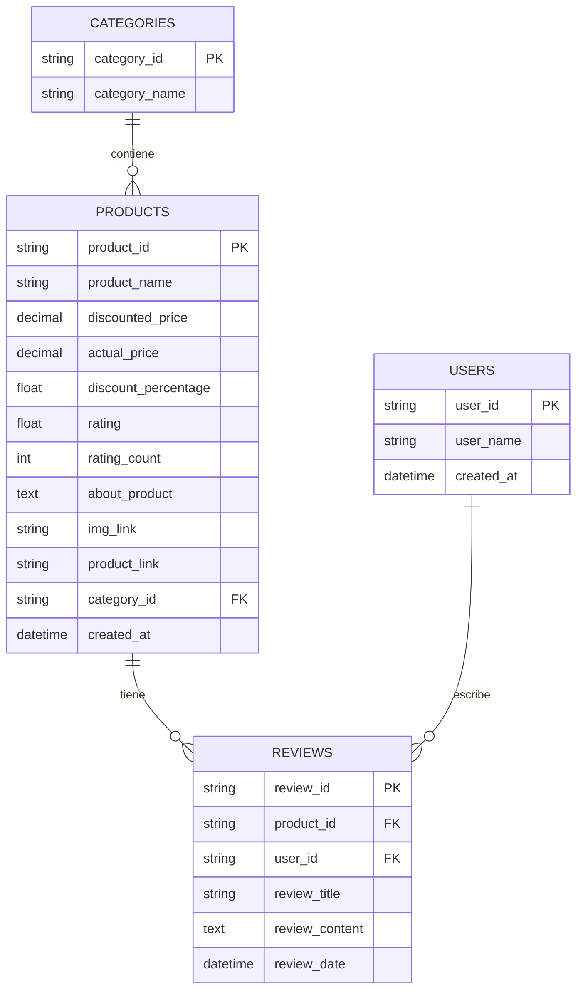
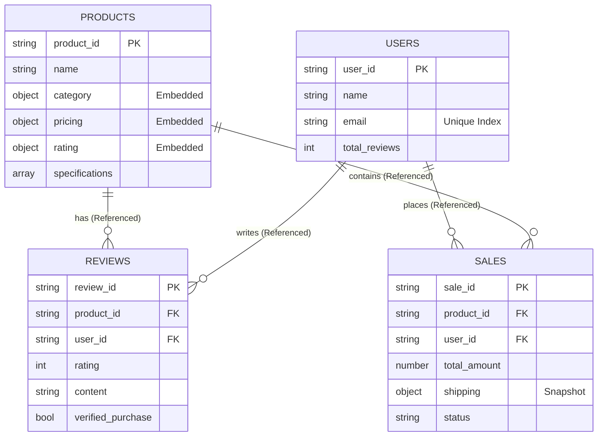

# 🚀 GlobalMarket Analytics & Search Engine

<div align="center">


**Universidad Nacional Experimental de Guayana (UNEG)**
_Sistemas de Bases de Datos II • Semestre 2025-II_

[Características](#-características-principales) •
[Instalación](#-guía-de-instalación) •
[Arquitectura](#-arquitectura-de-datos) •
[Uso](#-uso-y-ejecución) •
[Equipo](#-equipo-de-desarrollo)

</div>

---

## 📋 Descripción del Proyecto

**GlobalMarket** es una implementación completa de un sistema de comercio electrónico utilizando **MongoDB Atlas**. Este proyecto demuestra la transición de un modelo relacional tradicional a una arquitectura documental NoSQL, diseñada específicamente para manejar Big Data en E-commerce.

El sistema ha sido optimizado para:

- ⚡ **Alto rendimiento** en consultas de agregación complejas.
- 📊 **Analytics en tiempo real** para dashboards de ventas.
- 🔍 **Búsqueda inteligente** (Fuzzy Search) con Atlas Search.
- 🛡️ **Integridad de datos** mediante validaciones estrictas JSON Schema.

---

## ✨ Características Principales

| Categoría               | Implementación                                                                                                                                                                                                               |
| :---------------------- | :--------------------------------------------------------------------------------------------------------------------------------------------------------------------------------------------------------------------------- |
| **🎯 Modelado**         | **Hybrid Pattern**: Embedding para lecturas rápidas y Referencing para escalabilidad.<br>**Computed Pattern**: Métricas pre-calculadas en documentos.<br>**Snapshot Pattern**: Historial de precios y direcciones en ventas. |
| **🔒 Calidad de Datos** | Validaciones `jsonSchema` estrictas en las 4 colecciones.<br>Reglas de negocio (precios positivos, emails válidos) a nivel de DB.                                                                                            |
| **🚀 Performance**      | Índices compuestos estratégicos para evitar _Collection Scans_.<br>Atlas Search (Lucene) para búsquedas de texto completo.<br>Índices únicos para garantizar integridad.                                                     |
| **📊 Analytics**        | 5 Pipelines de Agregación complejos (`$lookup`, `$unwind`, `$bucket`, `$graphLookup`).<br>Análisis de cohortes y segmentación de clientes VIP.                                                                               |

---

## Arquitectura de Datos

### Modelo de Datos Relacional (Diagrama Entidad-Relación - ERD):



### Modelo de Datos NoSQL (MongoDB/JSON Schema):



### Estrategias de Diseño

| Colección  | Estrategia                | Justificación Técnica                                                                                              |
| :--------- | :------------------------ | :----------------------------------------------------------------------------------------------------------------- |
| `products` | 🔄 **Hybrid (Embedding)** | Categorías, precios y ratings embebidos para lectura rápida (`O(1)`). Evita JOINs costosos en la vista de detalle. |
| `reviews`  | 🔗 **Referencing**        | Colección separada para evitar el límite de 16MB por documento (BSON Limit) en productos populares.                |
| `users`    | 🔗 **Referencing**        | Entidad independiente. Facilita el cumplimiento de normas de privacidad y gestión de perfiles.                     |
| `sales`    | 📸 **Ref + Snapshot**     | Referencia al producto pero **duplica** datos históricos (precio al momento de venta, dirección de envío).         |

---

## 🛠️ Guía de Instalación

### Prerrequisitos

- **Python 3.8+** (Para scripts ETL)
- **MongoDB Shell (`mongosh`)**
- **MongoDB Database Tools** (`mongoimport`, `mongoexport`)
- **Cuenta en MongoDB Atlas** (Cluster M0 Gratuito)

### 📦 Paso 1: Configuración del Entorno

```bash
# 1. Clonar el repositorio
git clone [https://github.com/tu-usuario/globalmarket-analytics.git](https://github.com/tu-usuario/globalmarket-analytics.git)
cd globalmarket-analytics

# 2. Crear entorno virtual (Opcional pero recomendado)
python -m venv venv
source venv/bin/activate  # En Windows: venv\Scripts\activate

# 3. Instalar dependencias
pip install pandas pymongo
```

### 🔄 Paso 2: Transformación de Datos (ETL)

Prepara el dataset crudo (CSV) y conviértelo a documentos JSON limpios y estructurados.

```bash
python src/transform_data.py
```

> **Resultado:** Generará 4 archivos JSON en la carpeta `data/processed/` listos para importar.

### 🛡️ Paso 3: Aplicar Validaciones (Schema Validation)

Antes de cargar los datos, definimos las reglas del juego.

```javascript
// Conéctate a tu cluster Atlas
mongosh "mongodb+srv://<usuario>:<pass>@cluster.mongodb.net/globalmarket"

// Ejecuta el script de validación
load("validation.js")
```

Esto creará las colecciones con reglas como:

- ✅ `price >= 0`
- ✅ `email` con formato regex válido
- ✅ `rating` entre 0 y 5

### 📥 Paso 4: Ingesta de Datos

Usa `mongoimport` para cargar los datos masivamente. **Reemplaza `TU_STRING` con tu conexión de Atlas.**

```bash
# Script de carga masiva
mongoimport --uri "TU_STRING" --db globalmarket --collection products --file data/processed/products.json --jsonArray --drop
mongoimport --uri "TU_STRING" --db globalmarket --collection users --file data/processed/users.json --jsonArray --drop
mongoimport --uri "TU_STRING" --db globalmarket --collection sales --file data/processed/sales.json --jsonArray --drop
mongoimport --uri "TU_STRING" --db globalmarket --collection reviews --file data/processed/reviews.json --jsonArray --drop
```

### ⚡ Paso 5: Indexación Inteligente

Crea los índices para optimizar las consultas y habilitar Atlas Search.

```javascript
// Desde la consola de mongosh conectada:
load("index.js");
```

---

## 📊 Analytics y Consultas

Para ejecutar los pipelines de análisis de negocio:

```javascript
load("queries.js");
```

### 🔎 Detalles de los Pipelines

\<details\>
\<summary\>\<strong\>🏆 Pipeline 1: Ventas por Categoría y Mes\</strong\> (Click para expandir)\</summary\>

- **Objetivo:** Reporte financiero mensual.
- **Stages:** `$lookup` (unir productos), `$unwind`, `$addFields` (extraer fecha), `$group` (sumar ventas), `$project`.
- **Resultado:** Tabla con Total Ventas ($), Unidades y Ticket Promedio por categoría.

\</details\>

\<details\>
\<summary\>\<strong\>⭐ Pipeline 2: Top Productos (Ranking Ponderado)\</strong\>\</summary\>

- **Objetivo:** Identificar "Best Sellers" reales.
- **Lógica:** No solo usa el promedio de estrellas. Usa una fórmula de _score_: `Rating * ln(Numero de Reviews)`.
- **Filtro:** Solo productos con \>50 reseñas.

\</details\>

\<details\>
\<summary\>\<strong\>💰 Pipeline 3: Bucket Pattern (Rangos de Precio)\</strong\>\</summary\>

- **Objetivo:** Segmentación de mercado.
- **Técnica:** `$bucket`
- **Categorías:** Budget (0-500), Economy, Premium, Luxury (10k+).

\</details\>

\<details\>
\<summary\>\<strong\>👑 Pipeline 4: Análisis VIP (Bonus)\</strong\>\</summary\>

- **Objetivo:** CRM y Fidelización.
- **Métrica:** `VIP Score = Gasto Total * (1 + Frecuencia de Compra / 10)`.
- **Resultado:** Lista de usuarios para campañas de marketing dirigidas.

\</details\>

\<details\>
\<summary\>\<strong\>🌍 Pipeline 5: Tendencias Geográficas (Bonus)\</strong\>\</summary\>

- **Objetivo:** Logística.
- **Análisis:** Ventas por ciudad y tasa de éxito de entregas (`completed` vs `cancelled`).

\</details\>

---

## 📁 Estructura del Proyecto

```text
globalmarket-analytics/
├── data/
│   ├── raw/                    # Dataset original (CSV)
│   └── processed/              # JSONs generados por el ETL
├── src/
│   ├── data/transform_data.py  # Script ETL (Python)
│   ├── validation.js           # Creación de colecciones y reglas JSON Schema
│   ├── index.js                # Estrategia de indexación y Atlas Search
│   └── queries.js              # Pipelines de agregación (Business Logic)
├── schemas/                    # Documentación de esquemas (JSON)
├── README.md                   # Documentación principal
└── requirements.txt            # Dependencias
```

---

## 📈 Análisis de Performance (Explain Plan)

Demostración del impacto de los índices en el tiempo de respuesta:

**Consulta:** _Buscar productos en categoría "Electronics"_

| Escenario      | Tipo de Búsqueda | Tiempo de Ejecución   | Documentos Examinados |
| :------------- | :--------------- | :-------------------- | :-------------------- |
| **Sin Índice** | `COLLSCAN`       | \~150ms               | 1,465 (Todos)         |
| **Con Índice** | `IXSCAN`         | **\~5ms**             | 450 (Solo relevantes) |
| **Mejora**     |                  | **30x más rápido** 🚀 |                       |

---

---

## Charts Mongodb

[https://charts.mongodb.com/charts-globalmarket-analytics-se-vttjgmj/public/dashboards/c0145842-7bb1-45c2-bc1c-2493fbf35571](Charts Mongodb)

---

## Equipo de Desarrollo

Este proyecto fue desarrollado para la asignatura **Sistemas de Bases de Datos II** (UNEG).

| Rol                    | Responsabilidad                                                   | Integrante                    |
| :--------------------- | :---------------------------------------------------------------- | :---------------------------- |
| **Data Architect**     | Modelado de esquemas, ETL y diseño de colecciones.                | **[Nombre del Integrante 1]** |
| **Security Engineer**  | Implementación de validaciones JSON Schema y tests de integridad. | **[Nombre del Integrante 2]** |
| **Analytics Engineer** | Desarrollo de Pipelines de agregación y optimización de índices.  | **[Nombre del Integrante 3]** |

---

**Hecho con ❤️ por el Equipo GlobalMarket**
